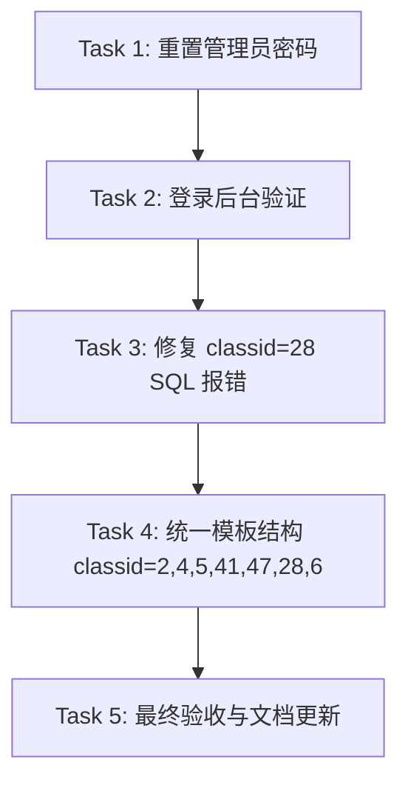

# TASK - 原子任务拆分

## 1. 任务依赖图

## 2. 任务详情

### Task 1: 重置管理员密码
- **输入**：`data/config.php`, `app/lib/class/sdcms_db.php`
- **输出**：`reset_pwd.php` 脚本
- **验收标准**：访问该脚本后显示“密码已重置”。

### Task 2: 修复 classid=28 SQL 报错
- **输入**：`app/home/controller/index/cate.php` (或相关控制器)
- **输出**：修复后的代码
- **验收标准**：访问 `?c=index&a=cate&classid=28` 不再显示 SQL 错误。

### Task 3: 统一模板结构
- **涉及文件**：`theme/2020/content/page/brand.php`, `brand2.php` 等
- **操作**：统一使用 `about.php` 的布局类名和结构。
- **验收标准**：各页面 Banner 显示完整（21:9），排版整齐。

### Task 4: 检查模板映射
- **涉及文件**：`data/config/category.php`
- **操作**：确保 `classid=2` 和 `classid=28` 映射到了正确的模板文件。
