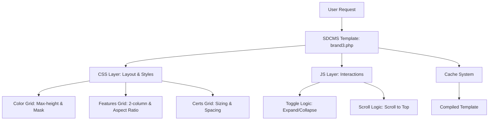

# DESIGN - UI Optimization

## 1. 整体架构图

## 2. 分层设计和核心组件
### CSS 层 (Styles)
- **.cloty-grid**: 核心容器，控制溢出和高度。
- **.cloty-grid.expanded**: 激活状态，取消高度限制。
- **.cloty-grid::after**: 蒙层实现。
- **.feature-grid**: 网格布局容器。
- **.cert-grid**: 厂家 Logo 容器。

### JS 层 (Interactions)
- **事件监听器**: 监听 `.cloty-more-btn` 的点击。
- **状态管理**: 通过 `hasClass('expanded')` 判断当前状态。
- **动画**: `animate({ scrollTop: ... })` 处理平滑回弹。

## 3. 接口契约定义 (HTML Hooks)
- `id="j_clotys"`: 花色区域锚点。
- `class="cloty-grid"`: 花色列表容器。
- `class="cloty-more-btn"`: 交互按钮。
- `id="j_features"`: 产品特点锚点。
- `id="j_certs"`: 授权厂家锚点。

## 4. 数据流向图
1. 用户点击“显示更多”。
2. JS 拦截事件，为 `.cloty-grid` 添加 `.expanded` 类。
3. CSS 触发 `max-height` 变化，动画展开。
4. 按钮文本更新为“收起更多”。
5. 再次点击，移除类名，JS 执行滚动回弹。

## 5. 异常处理策略
- **JS 失效**：若 JS 未加载，CSS 默认显示前两排，但按钮点击无效。确保 jQuery 在模板中已正确引入。
- **图片加载失败**：使用 `aspect-ratio` 预留空间，防止页面抖动。
- **缓存冲突**：自动化执行脚本中包含清理缓存步骤，确保最新代码生效。
