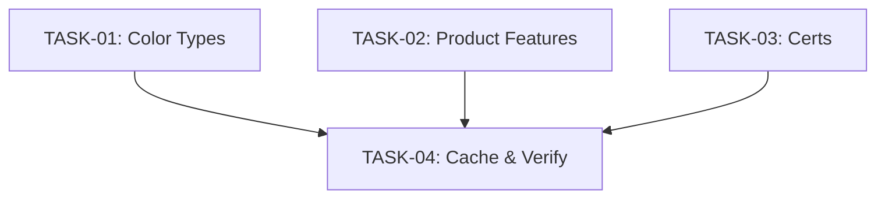

# TASK - UI Optimization

## 1. 子任务拆分

### TASK-01: 优化花色类型模块 (Color Types)
- **输入契约**：`brand3.php` 模板，jQuery 已加载。
- **输出契约**：
  - 更新 `brand3.php` 中的 CSS 样式。
  - 更新 `brand3.php` 中的 HTML 结构（添加按钮）。
  - 更新 `brand3.php` 中的 JS 逻辑。
- **验收标准**：默认 2 排，可展开/收起，有渐变遮罩。
- **优先级**：最高

### TASK-02: 优化产品特点模块 (Product Features)
- **输入契约**：`brand3.php` 模板。
- **输出契约**：
  - 更新 CSS 布局为 2 列 Grid。
  - 设置 `aspect-ratio: 926/350`。
  - 添加居中标题 HTML。
- **验收标准**：布局整齐，比例正确，标题显眼。
- **优先级**：中

### TASK-03: 优化授权厂家模块 (Certs)
- **输入契约**：`brand3.php` 模板。
- **输出契约**：
  - 更新 CSS 样式，增加 Logo 高度和间距。
- **验收标准**：Logo 尺寸变大，区域视觉更开阔。
- **优先级**：低

### TASK-04: 缓存清理与最终验证
- **执行步骤**：
  - 物理删除 `cache/compile/2020/content/page/` 目录下的所有 `.php` 文件。
  - 访问页面验证三项优化是否生效。
- **验收标准**：所有 UI 变更在浏览器中可见且功能正常。

## 2. 任务依赖图

