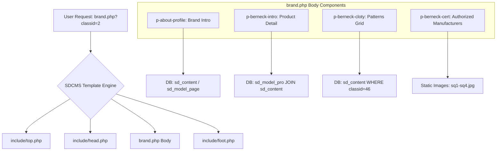
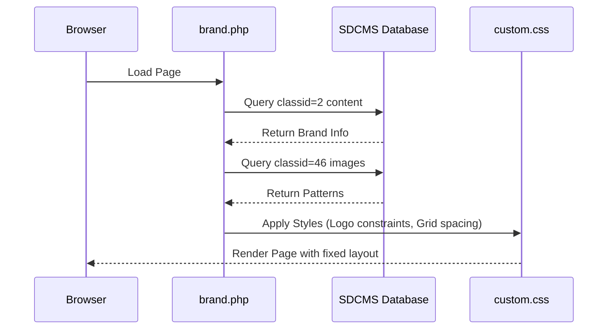

# DESIGN_brand_optimization.md

## 整体架构图

## 分层设计和核心组件
1. **品牌简介层 (`p-about-profile`)**：
   - 使用 Flexbox 布局，左侧 Logo (`about-cat`)，右侧文字及产品矩阵 (`pcont`)。
   - 核心组件：`profile-grids` (Grid 4列)。
2. **产品介绍层 (`p-berneck-intro`)**：
   - 使用 Grid 2列布局。
   - 数据源：`sd_model_pro` 与 `sd_content` 关联查询。
3. **花色展示层 (`p-berneck-cloty`)**：
   - 使用 Grid 4列布局替代原有的 Swiper。
   - 目的：提高图片加载稳定性。
4. **授权厂家层 (`p-berneck-cert`)**：
   - 使用 Grid 2列布局。
   - 样式：圆角容器 (`border-radius: 24px`)，背景浅灰。

## 接口契约定义
- **输入参数**：`classid=2` (主页面 ID)，`classid=46` (花色分类 ID)，`classid=26` (特点分类 ID)。
- **输出格式**：HTML + CSS (响应式)。

## 数据流向图

## 异常处理策略
- **图片缺失**：若 `sd_content` 中 `pic` 为空，显示默认占位图。
- **数据为空**：若查询结果集为空，隐藏对应区块 (`{if !isempty($rs)}...{/if}`)。
- **样式冲突**：使用更高优先级的 CSS 选择器（如 `.p-berneck .p-about-profile`）或 `!important`（慎用）来确保修复生效。
