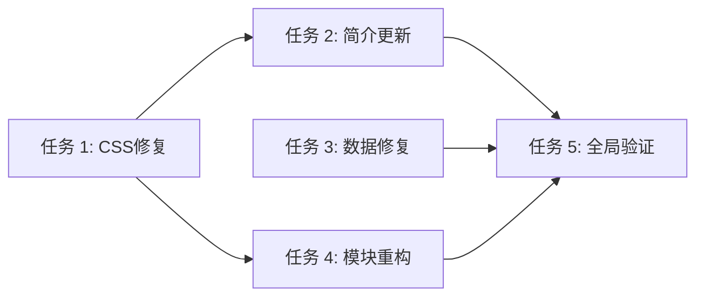

# TASK_brand_optimization.md

## 子任务拆分

### 任务 1: CSS 样式修复与优化
- **输入契约**：现有 `custom.css` 文件。
- **输出契约**：修复 Logo 拉伸、调整间距、定义 Grid 布局。
- **验收标准**：
  - Logo 容器 `.about-cat img` 具有 `max-width`, `max-height` 和 `object-fit: contain`。
  - 减小 `.p-berneck` 的底部 padding。
  - 添加 `.cloty-grid` 和 `.cert-grid` 的样式支持。
- **优先级**：高

### 任务 2: 品牌简介模块更新
- **输入契约**：`brand.php` 中的品牌简介部分，`p-about-profile` 组件。
- **输出契约**：更新 HTML 结构，添加 4 张产品图。
- **验收标准**：
  - `profile-grids` 包含 pro-1.jpg 到 pro-4.jpg，且布局为 4 列。
- **优先级**：中

### 任务 3: 产品介绍模块数据修复
- **输入契约**：`brand.php` 中的产品介绍部分。
- **输出契约**：修改 `sdcms:rs` 查询条件，修复指导零售价显示。
- **验收标准**：
  - 查询条件为 `sd_content.classid=2`。
  - 指导零售价文本显示正确。
- **优先级**：高

### 任务 4: 花色类型与授权厂家模块重构
- **输入契约**：`brand.php` 中的对应区块。
- **输出契约**：使用 Grid 布局替换 Swiper，修复图片缺失。
- **验收标准**：
  - 花色显示 20 个格子。
  - 授权厂家显示 sq1.jpg 到 sq4.jpg。
- **优先级**：中

### 任务 5: 页脚恢复与全局验证
- **输入契约**：`brand.php` 全文件，`include/foot.php`。
- **输出契约**：确保页脚正常加载并进行整体验收。
- **验收标准**：
  - 页面底部显示页脚内容。
  - 全页面无明显布局问题。
- **优先级**：高

## 任务依赖图

