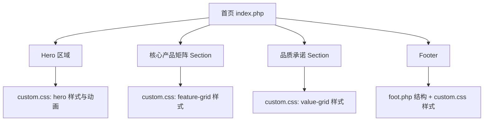
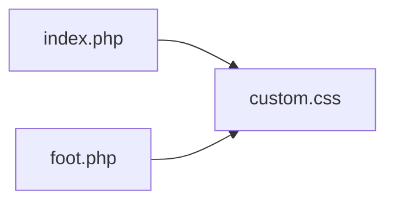
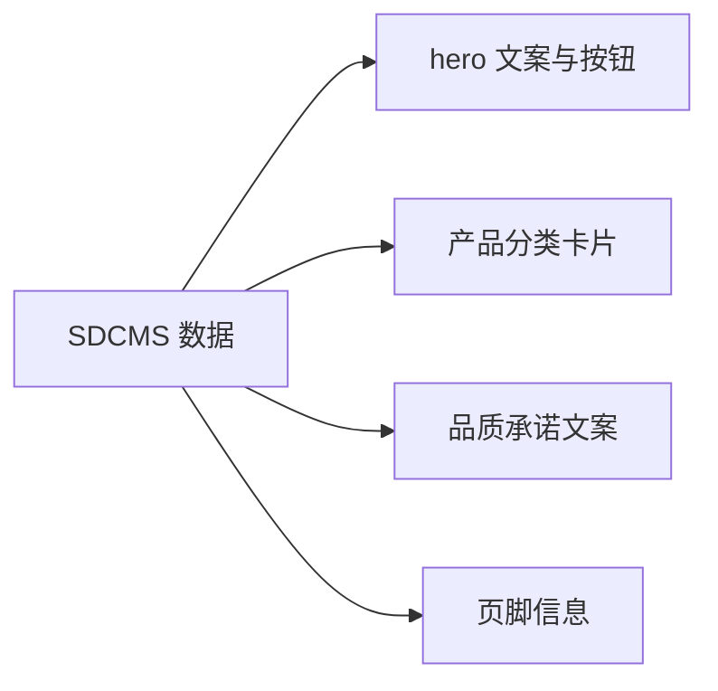

## 架构设计

## 分层与组件
- 结构层：index.php, foot.php
- 视觉层：custom.css
- 动效层：custom.css 的 keyframes

## 模块依赖

## 接口契约
- Hero 文案：`.hero-content` / `.hero-inner` 居中排版
- 产品矩阵：`.feature-grid` 更大卡片与间距
- 品质承诺：`.value-grid` 更大卡片与间距
- Footer：`.site-footer` 三列紧凑结构
- 动画：`hero-enter` 相关 keyframes

## 数据流

## 异常处理
- CSS 不生效：检查 custom.css 是否被正确引入
- 布局错位：回退到上一版样式并逐项恢复
