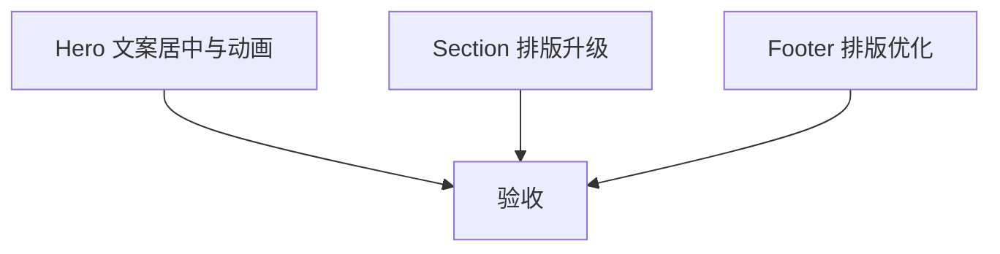

## 任务拆分

### 任务 1：Hero 文案居中与入场动画
- 输入契约：index.php 的 hero 结构与 custom.css
- 输出契约：hero 文案居中、按钮居中、入场动画生效
- 实现约束：仅 CSS 动效，保持白/绿主题
- 依赖关系：无

### 任务 2：核心产品矩阵与品质承诺排版升级
- 输入契约：section 与 grid 结构
- 输出契约：卡片更大、留白更舒展、整体更“大气”
- 实现约束：不改数据，仅改布局与样式
- 依赖关系：无

### 任务 3：Footer 排版优化
- 输入契约：foot.php 与 custom.css
- 输出契约：更短、更清晰的列结构与信息层级
- 实现约束：保留必要联系方式与备案信息
- 依赖关系：无

## 依赖关系图

