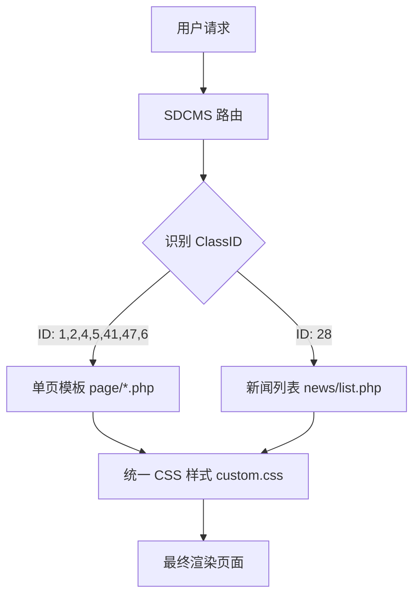

# DESIGN_页面统一优化

## 整体架构图

## 核心组件
- **Banner 组件**：`.mbnr` 类，控制 21:9 比例和 `object-fit: contain`。
- **布局容器**：`.wm` 类，固定最大宽度 1480px，水平居中。
- **内容块**：`.pbody`, `.p-berneck-profile` 等，提供统一的内边距和圆角阴影。

## 数据流向
- 页面通过 `{$mynybanner}` 获取后台配置的栏目 Banner。
- 通过 `{sdcms:rs}` 查询子栏目内容（如产品特点、荣誉资质）。

## 异常处理
- 若栏目未配置 Banner，`.mbnr` 将显示默认背景色或留空。
- SQL 错误已通过在 `news/list.php` 中显式指定表名前缀（`sd_content.classid`）解决。
